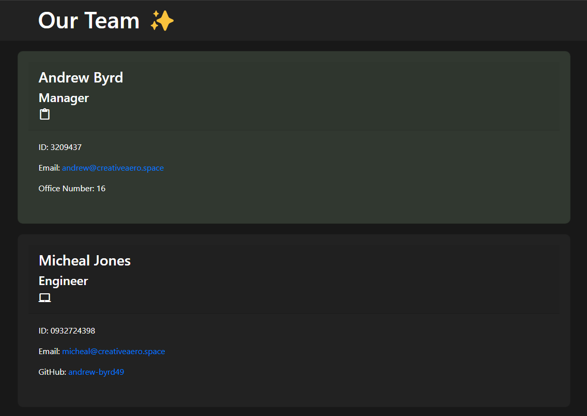

# Team Profile Generator 

## Description 
This application has been created to provide businesses with a hub to manage all of their team members, and their imformation; like email, GitHub usernames, team member ID, and more.
 
## Table of Contents
* [Installation](#installation)
* [Usage](#usage)
* [License](#license)
* [Tests](#tests)
* [Questions](#questions)

## Installation 
In your terminal, clone this repository using the SSH key. Once cloned, initialize npm, using `npm init`, then running `npm install`, `npm install inquirer`, and `npm install jest`.
## Usage 
To run this application, run `node app`, bringing up the prompts that will create your team members profile.

To view a demonastration of this application in use, click <a href='https://drive.google.com/file/d/1LA3NXTvI2FBt7CcIDlmtYfx5cyTKrZBZ/view'>HERE</a>.

## License 
This project is license under MIT

## Tests
Run `npm test` to run Jest for tests on constructors. 

## Questions
If you have any questions about this projects, feel free to contact me at <a href='mailto:andrew@creativeaero.space'>andrew@creativeaero.space</a>. You can view more of my projects at <a href='https://github.com/andrew-byrd49'>Andrew-Byrd49</a>